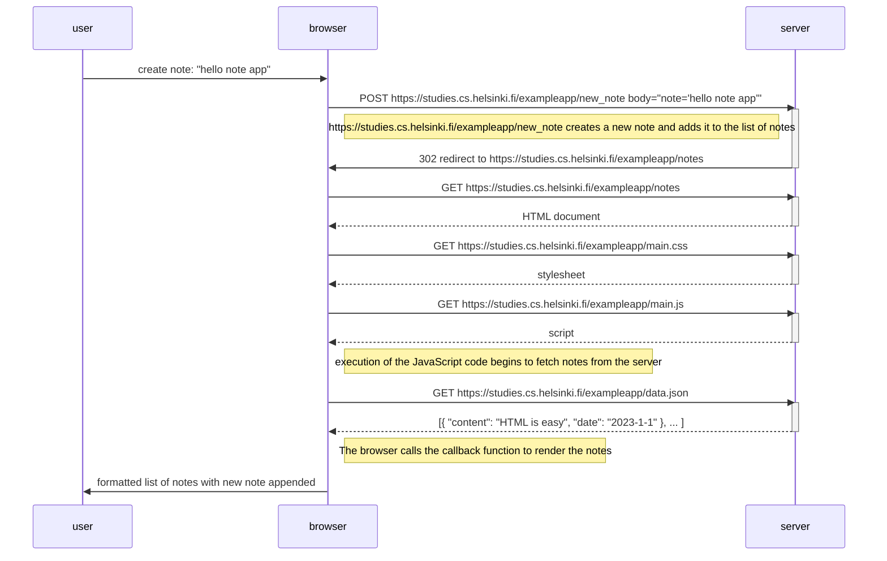

# fundamentals of web apps

- images are fetched as they are met by the browser while rendering the document received as `Response` from the server.
  - other assets-stylesheets, scripts--are fetched in the same way.
- requests are typed: `document`, `script`, `stylesheet`, `xhr`

## new note diagram

